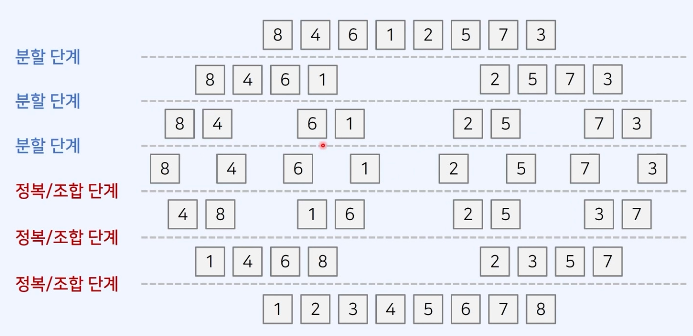

# 정렬

## 선택 정렬
매 단계에서 가장 작은 원소를 선택해서 앞으로 보내는 정렬  
앞으로 보내진 원소는 더 이상 위치가 변하지 않는다.  
이미 정렬되어 있던, 없던 비 효율적이다.  
시간복잡도: O(N^2)로 비효율적인 정렬 알고리즘 중 하나이다.
```javascript
function selectionSort(arr) {
  for (let i=0; i<arr.length; i++) {
    let minIndex = i;
    for (let j = i+1; j<arr.length; j++) {
      if (arr[minIndex] > arr[j]) {
        minIndex = j;
      }
    }
    // 스와프
    let temp = arr[i];
    arr[i] = arr[minIndex];
    arr[minIndex] = temp;
  }
}
```

## 버블 정렬
단순히 인접한 두 원소를 확인하여, 정렬이 안 되어 있다면 위치를 서로 변경한다.  
이미 정렬되어 있던, 없던 비 효율적이다.   
시간복잡도: O(N^2)로 비효율적인 정렬 알고리즘 중 하나이다.

```javascript
function bubbleSort(arr) {
  for(let i=arr.length - 1; i>0; i--) {
    for(let j=0; j<i; j++) {
      if (arr[j] < arr[j+1]>) {
        let temp = arr[j];
        arr[j] = arr[j+1];
        arr[j+1] = temp;
      }
    }
  }
}
```

## 삽입 정렬
기본적으로 왼쪽에 있는 부분은 이미 정렬이 되어 있다고 가정하고 정렬 한다.  
점점 정렬된 곳에서 들어갈 위치를 찾아 가기 때문에(위치를 찾으면 멈춘다.)  
시간복잡도: 정렬이 안 된 배열에 대해, O(N^2)로 비효율적인 정렬 알고리즘 중 하나이다.  
이미 정렬된 배열에 대해서 훨씬 빠르게 정렬 된다  

```javascript
function insertSort(arr) {
  for(let i=1; i<arr.length; i++) {
    for(let j=i; j>0; j--) {
      if(arr[j] < arr[j-1]) {
        let temp = arr[j];
        arr[j] = arr[j-1];
        arr[j-1] = temp;
      }
      else {
        break;
      }
    }
  }
}

```


## 병합 정렬
분할 정복의 아이디어를 활용 함  
- 분할: 큰 문제를 작은 부분 문제로 분할한다.
- 정복: 작은 부분 문제를 각각 해결 한다.
- 조합: 해결한 부분 문제의 답을 이용하여 다시 큰 문제를 해결한다.  
일반적으로 재귀 함수를 이용하여 구현  




- 병합 정렬에서의 분할 정복
1. 분할
분할 작업은 단순히 배열의 크기를 절반으로 쪼개는 것이다.
2. 정복
두 개의 부분 배열을 "정렬된 하나의 배열로"로 만든다.  
시간복잡도 O(NlogN)을 보장하는 빠른 정렬 알고리즘 중 하나이다.  
일반적인 경우, 정복과정에서 임시 배열이 필요하다

```javascript
function merge(arr, left, mid, right) {
  let i = left;
  let j = mid+1;
  let k = left //결과 배열의 인덱스
  let sorted = []
  while(i<=mid && j <= right) {
    if (arr[i] <= arr[j]) sorted[k++] = arr[i++]
    else sorted[k++] = arr[j++]
  }
  // 왼쪽 배열에 대한 처리가 다 끝난 경우
  if (i > mid) {
    for(; j<=right; j++) sorted[k++] = arr[j];
  }
    // 오른쪽 배열에 대한 처리가 다 끝난 경우
  if (j > right) {
    for(; i<=mid; i++) sorted[k++] = arr[i];
  }
  // 정렬된 배열 결과를 원본 배열에 반영하기
  for(let x=left; x<=right; x++) {
    arr[x] = sorted[x];
  }
}

function mergeSort(arr, left, right) {
  if (left < right) {
    let mid = parseInt((left+right) / 2)
    mergeSort(arr, left, mid);
    mergeSort(arr, mid+1, right);
    merge(arr, left, mid, right);
  }
}
```

## JS 정렬 라이브러리 정리
js에는 배열에 포함된 데이터를 정렬하는 sort()함수를 제공한다.  
시간 복잡도 O(NlogN)을 보장한다, 만약 sort() 함수의 사용이 제한된다면 병합 정렬을 구현해야함  
sort()함수는 정렬이 안되면 그 순서를 유지하는 stable sort를 유지한다.

### sort() 함수의 사용 방법
arr.sort(conpareFunction);  
compareFunction이 없다면 오름차순으로 정렬 됨
- compareFunction
두 개의 원소 a, b를 입력으로 받는다.  
1. 반환 값이 0보다 작은 경우 -> a가 우선순위가 높아, 앞에 위치한다.
2. 반환 값이 0보다 큰 경우 -> b가 우선순위가 높아, 앞에 위치한다.
3. 반환 값이 0인 경우 -> a와 b의 순서를 변경하지 않는다.
- 정렬 기준 함수를 사용하지 않으면 각 원소는 문자열로 취급 된다.  
유니코드 값 순서대로 오름차순 정렬된다(대문자 > 소문자, 80 < 9)  

```javascript
let arr = [1, 8, 5, 9, 21, 3, 7, 2, 15]

// 이해하기 어려웟어서 추가 설명: return값이 1일때는
// return값이 1일때는 b에게 우선순위가 있다 (b가 a보다작을 때)
// return값이 -1일때는 a에게 우선순위가 있다 (a가 b보다 작을 때)
// 즉 작은 놈이 우선순위를 가져 (오름 차순이 됨)
function compare(a, b) {
  if (a < b) return -1;
  else if (a > b) return 1;
  else return 0;
}

// 간단한 예시
function compare(a, b) {
  return a-b;
}
arr.sort(compare)

console.log(arr)
```

## 다양한 형식에 대한 오름차순 정렬

1. 문자 대/소문자 구분 없이 오름차순 정렬
```javascript
function compare(a, b) {
  let upperCaseA = a.toUpperCase()
  let upperCaseB = b.toUpperCase()

  if (upperCaseA > upperCaseB)
    return -1
  else if(upperCaseA < upperCaseB)
    return 1
  else 0

  // return uppserCaseA - upperCaseB
}
```

2. 객체에 대하여 원하는 기준으로 오름차순 정렬

```javascript
let arr  = [
  { name: "홍길동", score: 90 },
  { name: "김철수", score: 85 },
  { name: "박영희", score: 97 }
];

function compare(a, b) {
  return b.score - a.score;
}
```