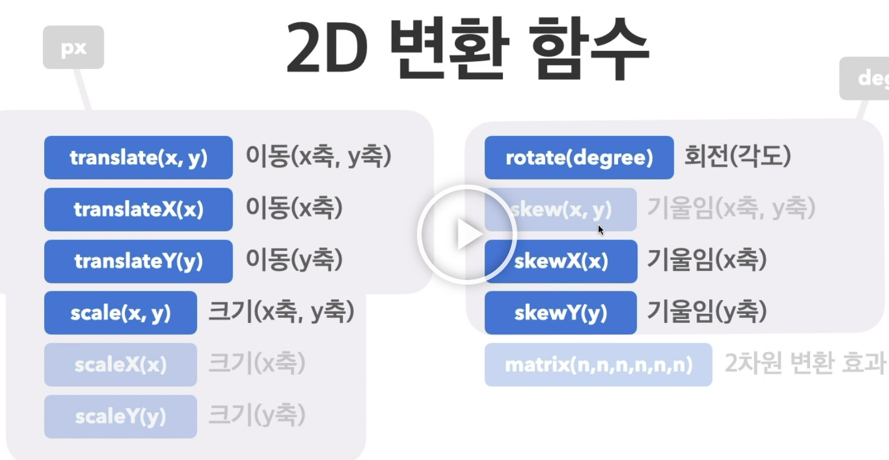

# 전환과 변환

## 전환
요소의 전 상태 후 상태를 자연스럽게 이어주는 것

### transition
단축 속성  
- 속성명
transition-property  
기본 값: all(모든 속성에 적용)  
속성 이름(전환 효과를 사용할 속성 이름 명시)
- 지속시간(필수 속성)
transition-duration  
기본 값: 0s(전환 효과 없음)  
시간 (지속 시간s을 지정)
- 타이밍함수 
transition-timing-fuction  
기본 값: ease (느리게 - 빠르게 - 느리게)  
linear, ease-in, ease-out, ease-in-out
- 대기시간
transition-delay  
기본 값: 0s(대기시간 없음)  
시간

## 변환

### transform
transform: 변환함수1 변환함수2 변환함수3 ...  
transform: 원근법 이동 크기 회전 기울임  
- 2D 변환 함수

- 3D 변환 함수

### 원근법과 rotateX,Y

아무리 rotate해도 원근법 없이는 시각적으로 들어오지 않고, 원근법은 무조건 제일 앞에 적어야 한다.
- 원근법 예시

### skewX,Y

눈으로 안 보면 모르는 변환이지만, 가끔 쓰인다!

### perspective
함수가 아닌 CSS 속성
기본 값: 0  
단위: deg

### perspective 함수와 속성의 차이

- 예시
