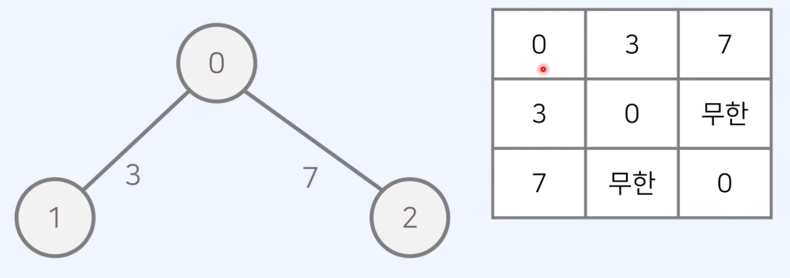
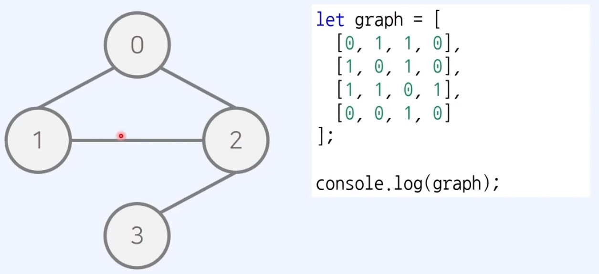
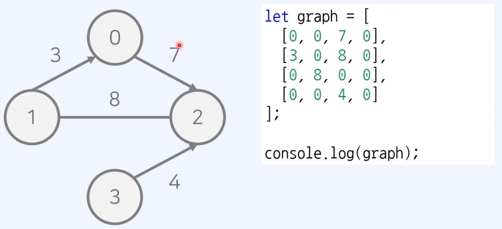
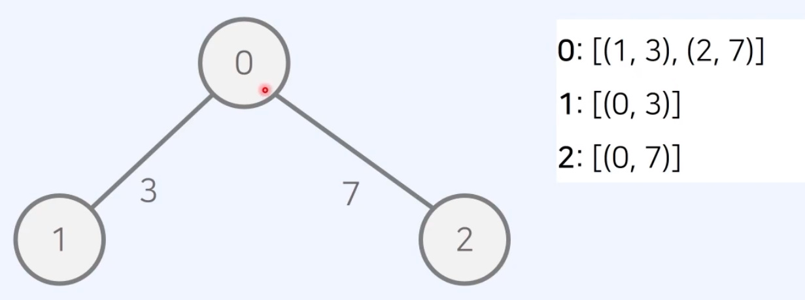
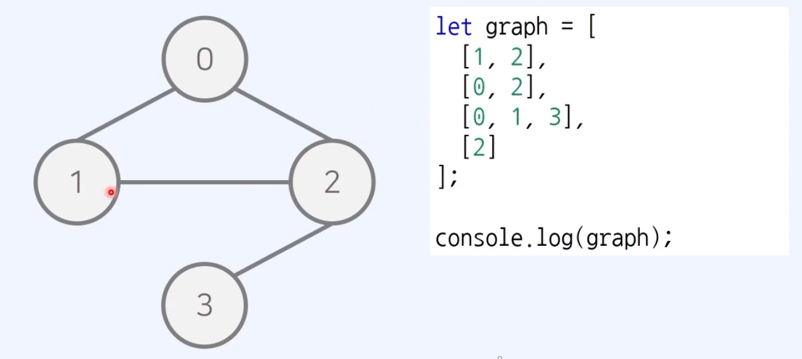
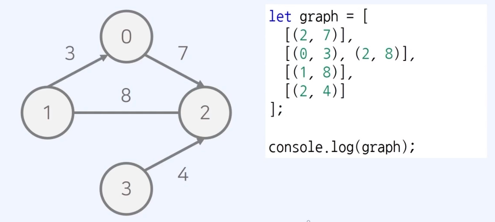
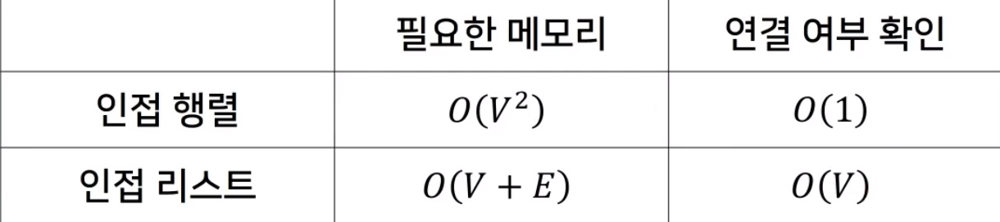

# 그래프 표현 방법
## 인접 행렬(2차원 배열)

- 기본적인 표현 예시

- 무방향 무가중치 그래프

- 방향 가중치 그래프

## 인접 리스트(연결 리스트)

- 기본적인 표현 예시

- 무방향 무가중치 그래프

- 방향 가중치 그래프

## 인접 행렬 VS 인전 리스트의 시간 복잡도 차이
1. 인접 행렬
모든 정점들의 연결 여부를 저장해 O(V^2)의 공간을 요구한다.  
두 노드의 연결 여부를 O(1)에 확인할 수 있다.
2. 인접 리스트
연결된 간선의 정보만을 저장하여 O(V+E)의 공간을 요구한다.  
두 노드의 연결 여부를 확인 하기 위해 O(V)의 시간이 필요하다.

### 최단 경로 알고리즘
각각 근처의 노드와 연결되어 있는 경우가 많으므로,  
간선 개수가 적어 인접 리스트가 더 효율적이다.