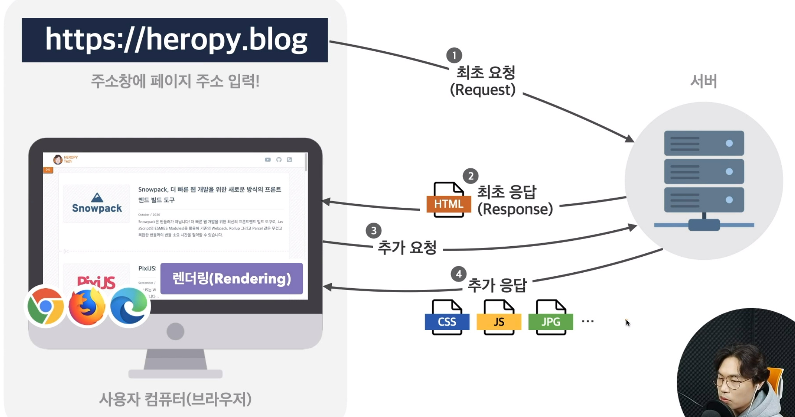

# 프론트엔드의 기초

## 요약
패스트캠퍼스 프론트엔드 기초 강의를 수강하며 정리한 내용들입니다.

## 서론

### 프론트엔드 개발이란?
HTML, CSS, JS를 사용해 데이터를 그래픽 사용자 인터페이스(GUI)로 변환하고,
그것으로 사용자와 상호 작용할 수 있도록 하는 것.

## 본론

### html,css 그리고 js
- html
Hyper Text Markup Language(Hyper Text: 링크 텍스트)의 약자
페이지의 제목, 문단, 표, 이미지 와 같은 웹의 구조를 담당
- CSS
Cascading Style Sheets의 약자
실제 화면에 표시되는 콘텐츠를 꾸며주는 디자인을 담당
- JS
콘텐츠를 바꾸고 움직이는 등 페이지를 동작시키는 동적 처리를 담당

### 웹앱의 동작 방식

내가 해야 할일은 html, css, js를 활용해 열심히 로컬환경에서 웹을 제작하고 서버에 업로드해
사용자가 서버에 요청하면 렌더링에 필요한 html, css, js파일들을 전송할 수 있게 해주는 것.

### 웹표준과 브라우저
W3C에서 여러 단계를 거쳐 웹 표준 기술을 지정한다.
해당 기술은 브라우저(공급업체)에서 작동하고 공급업체들은 표준 기술을 참고하여 브라우저를 제작한다.    
**크로스 브라우징**:이러한 공급업체들도 웹 표준 기술을 해석하는 방식이 다르기 때문에 브러우저마다 동작 방식이 다를 수 있다.  
**뷰표트**: 하나의 웹 페이지가 렌더링 되는 영역

### 특수 문자 용어
- 그레이브 기호(백틱) : 1 왼쪽에 있음
- 틸드 : 1 왼쪽에 있음
- 골뱅이는 assing으로 불림
- ^: 캐럿: ~의 이상을 표현
- &: 퍼센트, 앰퍼센드
- -: 하이픈, 대시, 마이너스
- _: 로대시, 밑줄, 언더 스코어
- ": 큰 따움표
- ': 작은 따움표
- : 콜런
- ; : 세미 콜론
- | : 버티컬 바
- () : 소괄호
- {} : 줄괄포 , 브레이스
- [] : 대괄호, 브래킷
