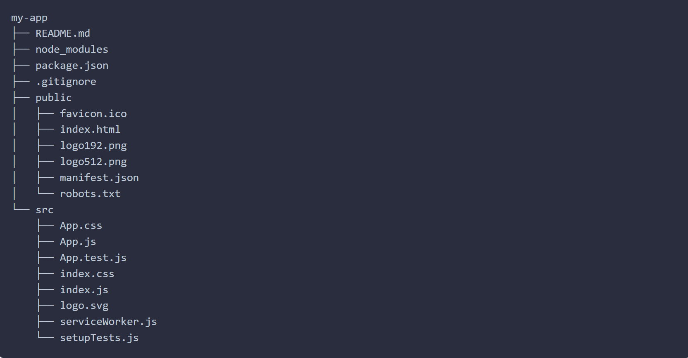

# CRA에 대해서
webpack과 babel Bundler를 자동으로 설치해 리액트 개발 툴 환경을 설치하는 npm 명령어이다.

## 사용방법

```javascript
npx create-react-app my-app
cd my-app
npm start
```

### npx와 npm의 차이
npm 5.2버전부터 npx 명령어가 제공된다  
npx명령어란: 모듈을 로컬환경에 설치하지 않고, 원격에 있는 것을 한번 실행 하는 것이기 때문에, CRA같이 매번 최신 버전을 설치해야하는 모듈 설치시 큰 도움이 되는 명령이다.

## CRA 프로젝트 폴더 구조

- public/index.html: 페이지 템플릿
- src/index.js: js의 엔트리 지점  
위 두 파일을 제외하면 파일 이름을 지우거나 바꿀 수 있다.  
webpack은 src안에 JS와 CSS 파일들을 넣어둬야 빌드 해 준다.

## Script
- npm start
개발 서버에 프로젝트를 빌드해준다 "Open http://localhost:3000"  
변경 사항도 저장 시 바로 반영 된다 (에러는 콘솔창에 뜬다)
- npm test
파일 변경과 관련 된 테스트를 수행하며, 테스터와 상호작용이 가능하다  
[리액트 테스트 자세히 보기](https://create-react-app.dev/docs/running-tests/)
- npm run build
배포용 앱을 build 폴더에 빌드하고, bundle과 최적화 build를 해준다  
build는 최소화 된 파일이고, hash된 파일 이름을 가진다.

## 폴리필과 지원 기능
- Exponentiation Operator (ES2016).
- Async/await (ES2017).
- Object Rest/Spread Properties (ES2018).
- Dynamic import() (stage 4 proposal)
- Class Fields and Static Properties (part of stage 3 proposal).
- JSX, Flow and TypeScript.
등을 지원하지만 (such as Array.from() or Symbol)과 같은 기능은 지원하지 않기에  
대상 브라우저가 지원해주는지, 수동 폴리필이 있는지 확인 해야 한다.

## esLint
CRA에는 기본 eslint가 있기 때문에, config파일에 extends를 이용해 rule을 확장 해야 한다.
1. 확장 하는 방법

```json
{
  "eslintConfig": {
    "extends": ["react-app", "shared-config"],
    "rules": {
      "additional-rule": "warn"
    },
  }
}
```

2. 특정 파일에만 특정 룰 추가 하기

```json
{
  "eslintConfig": {
    "extends": ["react-app", "shared-config"],
    "rules": {
      "additional-rule": "warn"
    },
    "overrides": [
      {
        "files": ["**/*.ts?(x)"],
        "rules": {
          "additional-typescript-only-rule": "warn"
        }
      }
    ]
  }
}
```