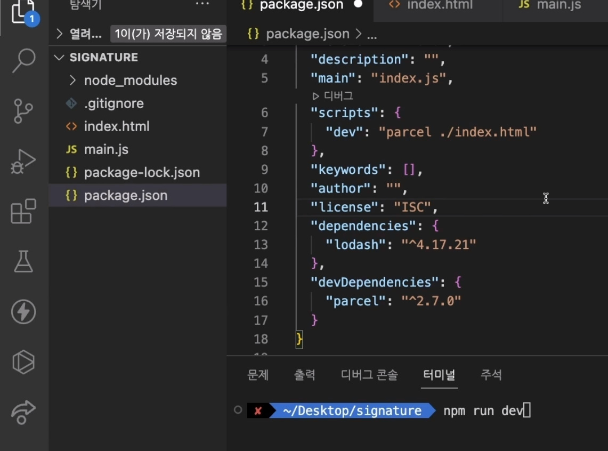
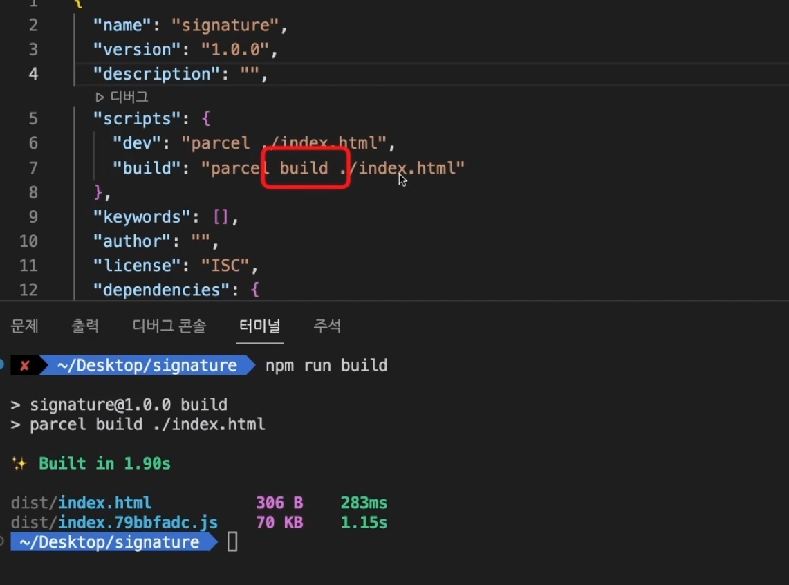

# Parcel

## Parcel이란?
로컬 환경의 개발 환경을 실제 웹 브라우저에서 동작할수 있는 hmtl 파일과 js파일로 빌드시켜주는 모듈

## Parcel 실행 방법
개발 환경에 모듈로 설치하고, script를 등록해서 사용해야 한다.  
개발 환경에 설치 했기 때문에, script 설치 안하고 직접 명령어 입력 시 에러 발생

## 실제 제품용으로 빌드
난독화 되어 있는 파일로 빌드 해줌 (용량 줄이기)
dist 파일 또한 언제든 만들 수 있기에 gitignore파일에 추가

