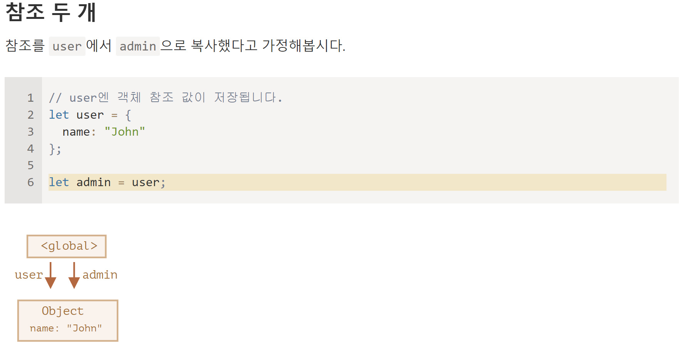
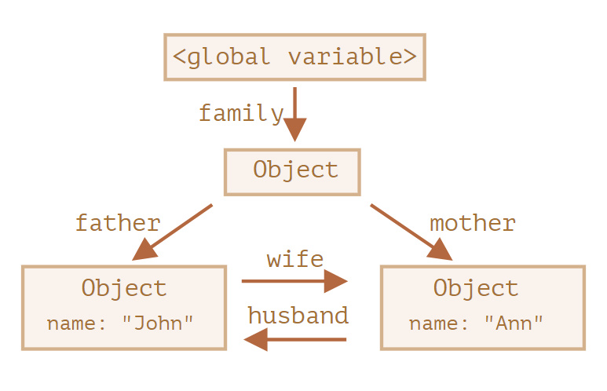
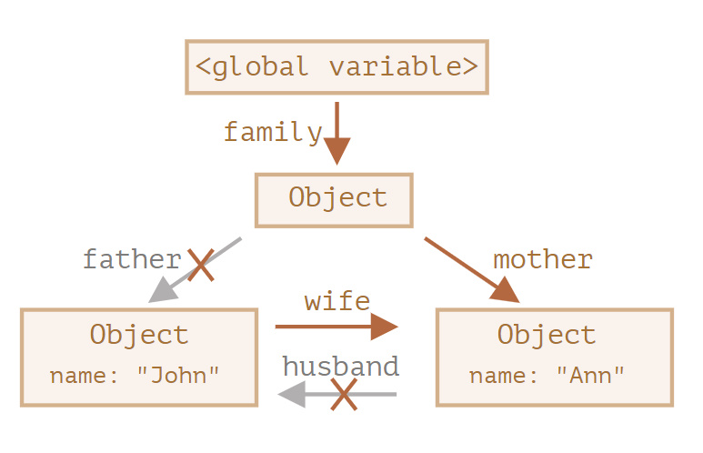
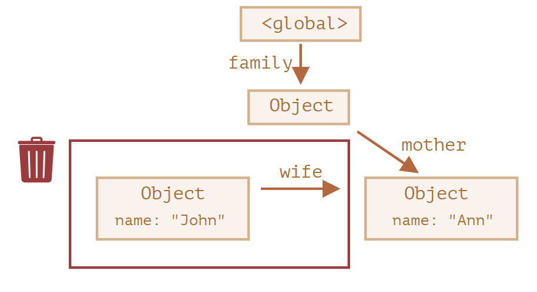
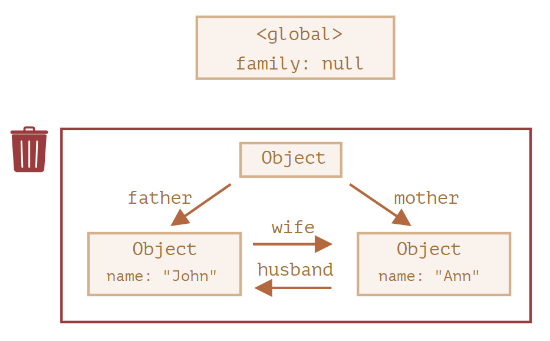

# 가비지 컬렉션
자바스크립트는 도달 가능성(reachability) 이라는 개념을 사용해 메모리 관리를 수행합니다.

1. 루트
아래 소개해 드릴값들은 그 태생부터 도달 가능하기 때문에, 명백한 이유 없이는 삭제되지 않습니다.
- 현재 함수의 지역 변수와 매개변수
- 중첩 함수의 체인에 있는 함수에서 사용되는 변수와 매개변수
- 전역 변수
- 기타 등등
2. 루트가 참조하는 값이나 체이닝으로 루트에서 참조할 수 있는 값은 도달 가능한 값이 됩니다.

## 참조 두개

위 상태에서 user = null해도 admin이 가르키고 있기에 메모리에 남는다.

## 연결된 객체

```javascript
function marry(man, woman) {
  woman.husband = man;
  man.wife = woman;

  return {
    father: man,
    mother: woman
  }
}

let family = marry({
  name: "John"
}, {
  name: "Ann"
});
```


```javascript
delete family.father;
delete family.mother.husband;
```



이후 John에 도달 불가능한 상태가 되면 John이 가르키는 대상이 있어도 삭제 된다.

최종

## 도달할수 없는 섬
객체들이 연결되어 섬 같은 구조를 만드는데, 이 섬에 도달할 방법이 없는 경우, 섬을 구성하는 객체 전부가 메모리에서 삭제됩니다.


## 내부 알고리즘

### mark-and-sweep
mark 된 모든 객체에 방문하고 그 객체들이 참조하는 객체도 mark 합니다. 한번 방문한 객체는 전부 mark 하기 때문에 같은 객체를 다시 방문하는 일은 없습니다.  
루트에서 도달 가능한 모든 객체를 방문할 때까지 위 과정을 반복합니다.
mark 되지 않은 모든 객체를 메모리에서 삭제합니다.
1. generational collection(세대별 수집) 
객체 상당수는 생성 이후 제 역할을 빠르게 수행해 금방 쓸모가 없어지는데, 이런 객체를 '새로운 객체’로 구분합니다. 가비지 컬렉터는 이런 객체를 공격적으로 메모리에서 제거합니다. 일정 시간 이상 동안 살아남은 객체는 '오래된 객체’로 분류하고, 가비지 컬렉터가 덜 감시합니다.
2. incremental collection(점진적 수집)
가비지 컬렉션을 여러 부분으로 분리한 다음, 각 부분을 별도로 수행합니다. 작업을 분리하고, 변경 사항을 추적하는 데 추가 작업이 필요하긴 하지만, 긴 지연을 짧은 지연 여러 개로 분산시킬 수 있다는 장점이 있습니다.
3. idle-time collection(유휴 시간 수집)
가비지 컬렉터는 실행에 주는 영향을 최소화하기 위해 CPU가 유휴 상태일 때에만 가비지 컬렉션을 실행합니다.

## V8엔진 공식 블로그 및 참고하면 좋은 곳들
- https://v8.dev/ V8 공식 블로그에도 메모리 관리 방법 변화에 대한 내용이 올라옵니다.
- V8 공식 블로그에도 메모리 관리 방법 변화에 대한 내용이 올라옵니다.

